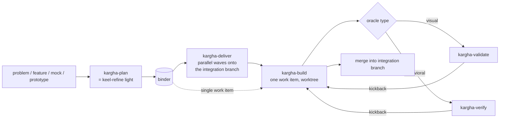

# kargha — ad-hoc orchestration via binder synthesis (design)

> **Status:** design — pending final user review, then an implementation plan.
> **Scope:** what kargha becomes and why. Finer mechanism details (merge-queue internals, env-injection contract, commit-tagging scheme) are deliberately left to the implementation plan.

## 1. Summary

kargha grows from a three-skill frontend plugin (`plan → build → validate`) into a narrow, **ad-hoc orchestration framework**. A user arrives the way they would at keel's `/keel-refine` — with a problem or feature description, and/or a design mock or a non-functional prototype — and kargha, without fail, **synthesizes a binder**: a plan made of work items. It then **delivers** that binder by building its work items in **parallel waves** onto a shared **integration branch**, each item verified against its own acceptance check (visual fidelity for UI, behavioral checks otherwise). The integration branch is the assembled result the user reviews and merges.

kargha borrows keel's concepts and disciplines — the binder, per-work-item contract + acceptance check, dependency ordering, declared-debt markers, halt-with-CTA, automated read-only gates that self-correct before escalating — but not keel's batteries: no setup lane, no invariants registry, no required doc structures, no schema interop, no persisted cross-run state. keel is batteries-included and gets better every run; kargha is narrow, unopinionated, repo-directed, ad-hoc.

## 2. Principles

kargha's own seven, plus two adopted from keel:

1. **Ad-hoc orchestration.** Per-run. No persisted inter-run state beyond the binder and git.
2. **Unopinionated, repo-directed.** No required architecture or doc structures. Read what the repo has, ask when context is thin, never block on missing docs.
3. **Stack-agnostic.** Frontend, backend, CLI, data pipeline, library/SDK, IaC, mobile, ML, docs — no domain assumptions. UI is one stack among many.
4. **Faster while accurate.** Parallel by default; serialize only where correctness or collision demands it.
5. **Borrow keel's disciplines, drop its batteries.** Concepts in; self-contained machinery out.
6. **Resolve early, autopilot after.** Front-load human judgment at plan time (the optional smart-surfaced review). Delivery then runs hands-off: **autopilot for success and low-signal work; halt-with-CTA only for a genuine blocker** (a failure, an unmet dependency, or an unapproved boundary crossing that self-correction can't resolve). The human enters delivery only on escalation — as in keel-drive.
7. **Stress the right things, give a way out.** Insist on what matters by default (a real CI-facing acceptance check, an automated boundary gate); always leave an escape hatch (opt out a check explicitly, "just this once").
8. **(keel P5) Snapshot, not timeline.** Everything kargha authors — **code comments *and* docs/binders** — states what *is*, never how it came to be. No changelogs, timestamps, or "was X, now Y" in content; git history carries the timeline.
9. **(keel P6) Code, specs, and tests win.** On conflict, delivered code and passing checks beat the binder's claims. "Done" means merged-and-passing; a binder claiming unbuilt work is stale, not a missing feature.

## 3. The pipeline

- **kargha-plan** (= keel-refine light): inputs → a synthesized, committed binder.
- **kargha-deliver**: binder → parallel-wave builds onto a per-binder integration branch.
- **kargha-build**: one work item → committed branch, merged into the integration branch. **No PR.**
- **kargha-validate** / **kargha-verify**: read-only acceptance gates (visual / behavioral) that **kick findings back to build** for self-correction; the human is reached only on escalation.
- A **single-work-item binder skips deliver** (the "just this once" hatch).

## 4. The binder — the spine

kargha synthesizes a binder on every run; it is the one artifact kargha is opinionated about. kargha-owned: keel's concepts, its own shape, design intelligence first-class, **not** schema-compatible with keel.

**Binder-level:** `motivation`; `scope` (included/excluded); `design_facts` (source design/prototype path + resolved stack, recorded once); `token_manifest` (the shared design-token map, only when a token system exists).

**Per work item:** `id`, `title`, `estimate`, `depends_on`; `design_reference` (view/route, or `none`); `component_map`/`icon_map`/`token_changes` (only where relevant); `contract` (the open-shape interface it exposes/consumes); `oracle` (the acceptance check); `serialize`/shared-resource tags.

**The acceptance check (oracle).** One verifiable "done" per item: `type ∈ {unit, integration, e2e, smoke, visual}` + assertions. **The definition of done is the minimum check you'd want CI to run** — kargha leans on the project's *real* CI-facing checks (its tests/build/type-check) plus item-specific assertions, not a check the model grades itself on. **A floor always applies: the change must at least compile / type-check / lint clean; below that, kargha does not auto-merge — it surfaces.** The user may supply their own check, or **opt out per item — but the opt-out is explicit and recorded (a marker), never silent**; kargha reports what it leaves unchecked.

**On disk + resume.** Detect → ask → default location (e.g. `.kargha/binders/<slug>.json`); never imposes a docs structure; committed on a `commit` verb. The binder is **read-only to build steps** (kargha commits it only at run boundaries, so a work item can't corrupt the plan). **Resume is git-native, made precise:** kargha tags each item's commits `[kargha:item-<id>]`, tags the integration tip per wave (`kargha/<slug>/wave-N`), and records failed/in-progress outcomes under a `refs/kargha/` namespace. An item is "done" only when **merged into the per-binder integration branch**. All git-native — still **no separate state file** (the user's YAGNI call holds).

## 5. kargha-plan — "keel-refine light"

keel-refine with the batteries removed: **drops** the bootstrap-gate preflight (→ a light, never-blocking repo detect), multi-binder partition (→ suggest a breakdown into the single binder's work items; one binder/run in V1), and roundtable decomposition. **Keeps + widens** intent ingestion (keel-refine inputs + design exports). **Lightens** repo context to best-effort stack understanding + interview where thin, never required. **Keeps** the synthesis subagent, a minimal interview loop, and commit-on-verb. **Replaces** the mandatory per-card walk with smart-surfaced review (§6).

**Cost education at binder creation.** kargha is **not** built for giant parallel runs. When scope is large, it tells the user plainly that this scope will cost time and money before they see anything tangible, and suggests a smaller first slice. It educates; it doesn't forbid.

## 6. Smart-surfaced review — the one human-in-the-loop point

This is where principle 6 lives: the human reviews **at plan time**, optionally, then delivery is hands-off. kargha auto-accepts routine cards and surfaces only those worth human judgment (review all / some / flagged). Surfacing is by **objective boundary signals** computed from the card's declared change — **not** self-assessed confidence. Surface if any: (1) **contract mutation** (public API/SDK signature, data/wire/DB schema, CLI flags/args/defaults, config keys; distinguish *new* surface from a change to an *existing* one); (2) **destructive op** (drop/delete/truncate/overwrite/migrate/force/revert); (3) **sensitive zone** (by path-convention + optional repo setting, not a wordlist); (4) **capability/resource escalation** (new dep, new IO, new infra, new integration); (5) **blast radius** (file/context thresholds, or a file edited by >1 item in this binder); (6) **genuine architectural novelty** (new pattern, not new-to-repo); (7) **explicit open question / conflict / ambiguous scope**. When stack detection is weak, kargha **asks** rather than guessing. It logs which signals it didn't compute.

**These same signals are re-checked at build time on the *actual* diff** (§9) — the plan-time pass is advisory triage; the build-time pass is the real gate, because the implementer can pivot into a boundary the plan never predicted.

## 7. kargha-deliver — parallel-by-wave onto an integration branch

**Default is parallel** (keel-drive's parallel-frontier model, flipped to default). kargha maintains a **per-binder integration worktree/branch** (`kargha/<slug>/integration`) that accumulates completed work.

**Wave loop:**
1. Re-derive the ready **frontier** — items whose deps are merged into integration. (`depends_on` is a **scheduling constraint**, not merely informational; **cycles are rejected at binder creation**.)
2. Build the wave's items **concurrently** (host's parallel primitive; serial fallback), each in its own worktree off the current integration tip.
3. **Barrier, then a serial merge:** each passing item, *before* merging, **re-validates against the current integration tip** (which may have advanced as wave-mates merged); on conflict/failure it rebuilds (bounded) or halts.
4. **Post-wave integration check:** after the wave's merges, run the project's build/type-check on the new integration tip. On failure, **revert to the wave's pre-merge tag and halt-with-CTA** — this catches *semantic* collisions that text-clean merges miss (item A renames a helper, item B used the old name).

Honest framing: kargha is **build-parallel, merge-serial-with-revalidation**. Building dominates wall-clock, so this is still fast; it is not "free" parallelism.

**Why an integration branch.** It resolves "an item depends on two parents" (the child builds off the tip, which already contains both — no impossible double-stack, no separate `integrate` skill); it is the resume record; and it is the single reviewable assembled result.

**Parallelism is proven-safe, not assumed.** Within a wave, items run concurrently only where **proven disjoint from declared file sets**; a runtime collision (a file touched that wasn't declared) halts or serializes. kargha does **not** claim to magically isolate a repo's runtime resources: the test env **binds to the wave** (started once, torn down once); items needing a stateful env get kargha-injected isolation params (`PORT`, `COMPOSE_PROJECT_NAME`) **only if the repo's command accepts them** — otherwise those items **serialize** (a "do not parallelise" trigger). The gates:

| Gate | Trigger |
|-|-|
| Dependency edge | dep not yet merged (correctness) |
| Shared / order-sensitive resource | wave-mates touch the same stateful resource — inferred file-overlap or a declared annotation |
| Stateful env without injectable isolation | the repo's env command can't be parameterized |
| File-collision risk | wave-mates likely edit the same files |
| Explicit `serialize` | the binder marks items must-serialize |

**Transactional model.** The binder is immutable while a wave runs; mutable only between waves. Backlog curation is the user's job.

## 8. Lifecycle (what happens when things go wrong)

- **Partial wave failure.** Passing items merge into integration. A failing item halts-with-CTA naming the cause; only items depending on it wait; the rest of the frontier continues. The user may **revert the wave** (reset to its pre-merge tag) or continue with the partial result.
- **Cleanup / interruption.** Every run removes its *successful and abandoned* temp worktrees and tears down any test env it started. It **preserves the failing item's worktree and prints its path in the CTA** so the user can debug in place. Committed branches + the integration branch persist. A later run detects leftovers and offers to clear them.
- **Running AI-written code safely (V1).** kargha runs only the project's *own* declared commands inside the isolated worktree and the repo-provided test env. Destructive/sensitive steps are caught by the build-time gate (§9). Container/network isolation is a later concern, noted, not V1.
- **Cost / time-to-feedback.** Per §5 — educate at binder creation; nudge toward a small first slice; no hard cap.

## 9. kargha-build & the verification layer

**kargha-build.** Implements one work item in an isolated worktree against the project's resolved conventions. Runs lint/test, then the acceptance loop. Declares deferrals inline with **declared-debt markers** (keel's KARTA-DEFER family). Runs a **secret scan (with an allow-list for benign matches) before each commit**. Tags commits `[kargha:item-<id>]`. Ends at commits; merges into the integration branch. **No PR** — the user reviews and merges the integration branch.

**The verification layer is keel's automated-gate pattern, registry-free.** Both gates are read-only, run in a **fresh AI session** (only the worktree, binder, and acceptance check — no build-session context), and are independent of the implementer. They run on the **actual diff** and check three things:
1. **Acceptance** — the oracle's assertions (visual fidelity for `kargha-validate`; `unit/integration/e2e/smoke` for `kargha-verify`).
2. **Contract conformance** — against an **external artifact** (type-checker, schema, contract test), *not* the binder's own declaration.
3. **Boundary scan** — does the actual diff cross a sensitive/destructive/contract boundary the item didn't justify? (The §6 signals, re-run on real code.)

On any finding, the gate **kicks back to build for bounded self-correction** and re-runs; **only on retry-exhaustion does it halt-with-CTA to the human** — exactly keel's `safety-auditor` (max 3) / `spec-reviewer` (max 2) shape, where the human is reached only on escalation. `kargha-verify` runs the repo-provided **pre-verify env command** (bound to the wave) before anything that needs an environment. `kargha-validate` is the existing skill (playwright capture + compare), now answering to the oracle's assertions.

## 10. Explicitly out of scope

keel binder-schema interop; a separate `submit`/`integrate` skill (the integration branch + user-merge replace them); invariants registry / fail-closed safety; setup/adopt lane; persisted backlog / handoff / progress-state *files* (resume is git-native); multi-binder partition (one binder/run in V1); self-assessed-confidence gating; **a human review gate during delivery** (keel's pattern is an automated gate that self-corrects and escalates, not a human gate).

## 11. Migration from today

- **kargha-plan**: design-export-only intake → keel-refine inputs; ticket emission → binder synthesis; mandatory walk → smart-surfaced review; adds cost education.
- **kargha-build**: stops opening PRs; merges into a per-binder integration branch; adds the acceptance loop, declared-debt markers, commit tagging, and a pre-commit secret scan.
- **kargha-validate**: pass/fail becomes acceptance-grounded; kicks back to build.
- **New skills**: `kargha-deliver`, `kargha-verify`.

## 12. Open questions / later

- Visual-validate tuning (pixel-diff tolerance, view serving) — the existing skill's concern.
- Sensitive-zone detection coverage (path-convention + repo setting) vs. false positives.
- Stack-detection confidence in thin repos — interview vs. proceed.
- Availability of an external contract artifact per stack (type-checker/schema) for the conformance check.
- Integration-branch behavior under concurrent *external* git changes between waves; auto-resolvable diamond merges vs. halt.
- **Mechanism details deferred to the implementation plan:** the serial merge-queue, the env-injection contract, and the commit/ref tagging scheme.
- **Post-V1:** ship the plainlanguage skill bundled in this repo (after V1 stabilizes), so kargha's plain-language doc voice travels with it.

## Appendix — blessed user-facing copy

Two blocks are blessed verbatim for kargha's user-facing docs (kept in project memory): the **parallelism gates** explanation and the **smart-surfaced review / definition-of-done** explanation. Reuse them word-for-word; both follow kargha's plain-language register.
